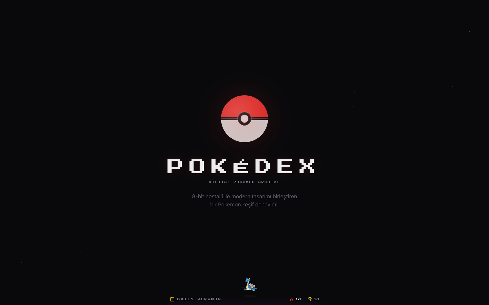
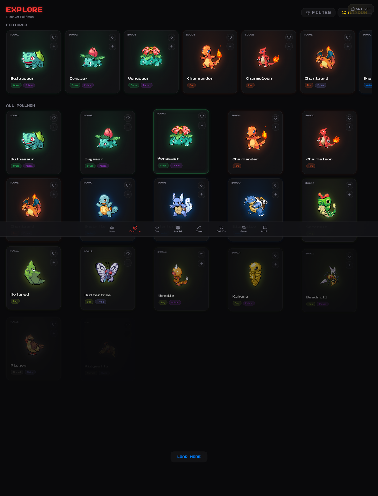
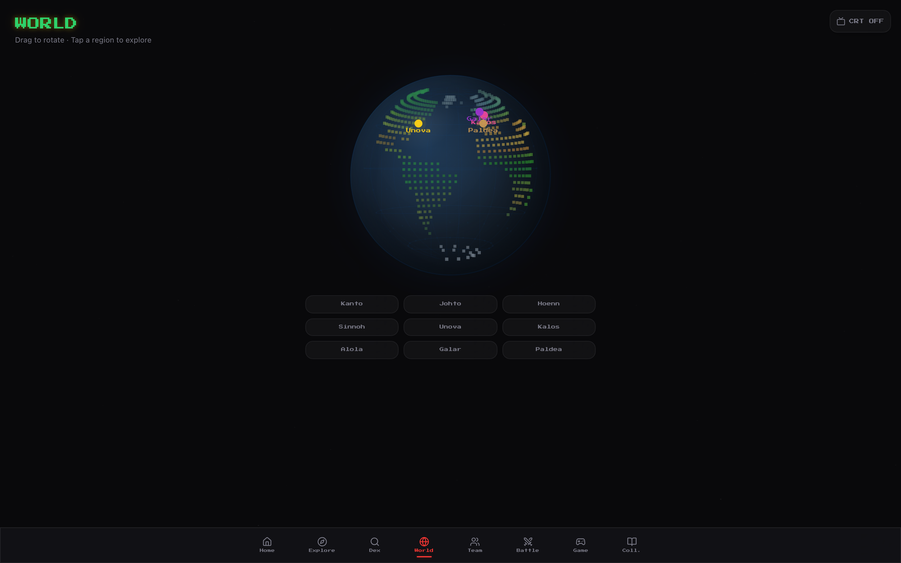
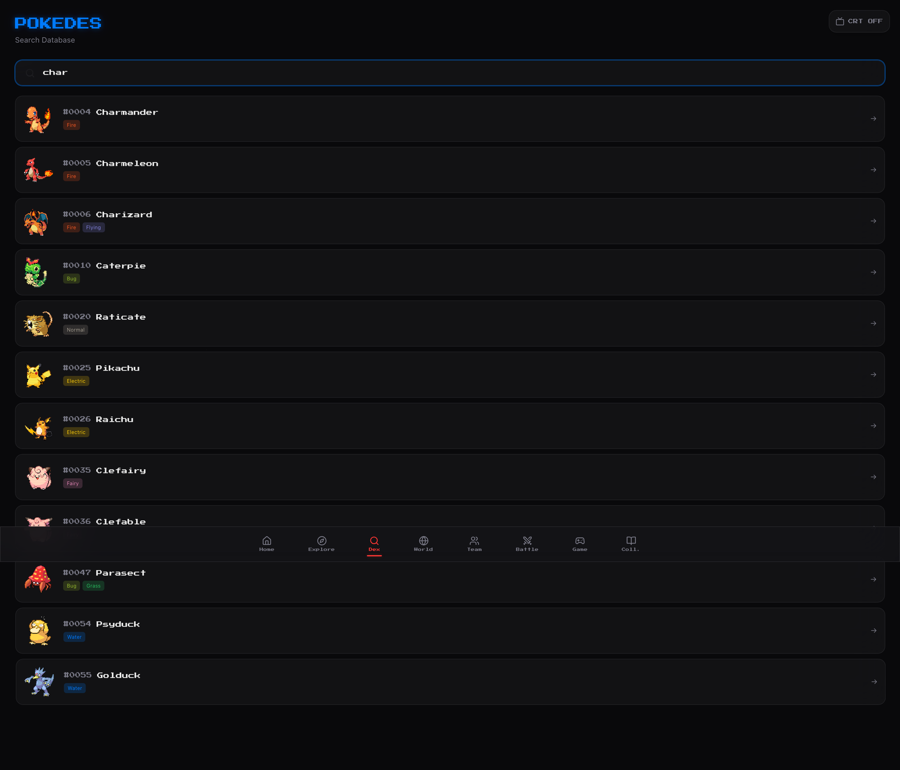
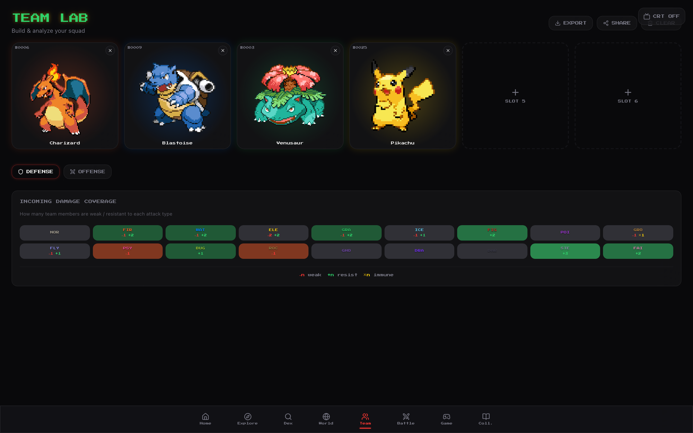
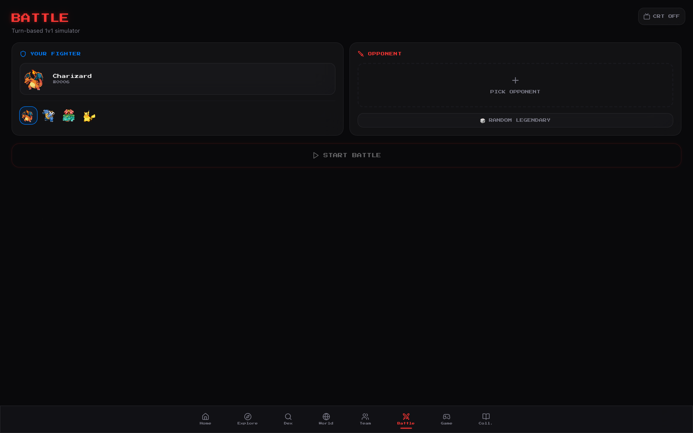
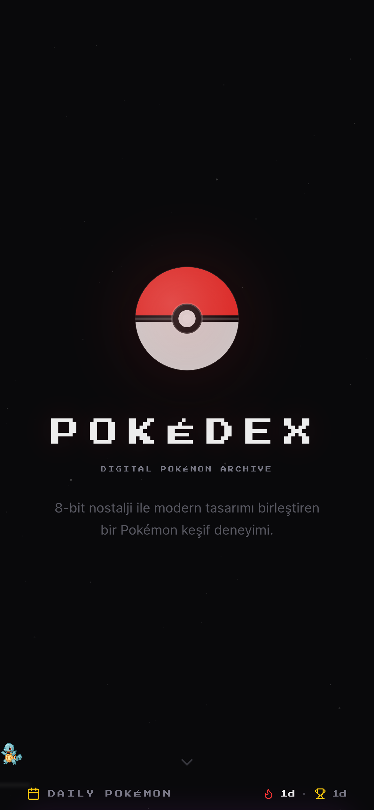
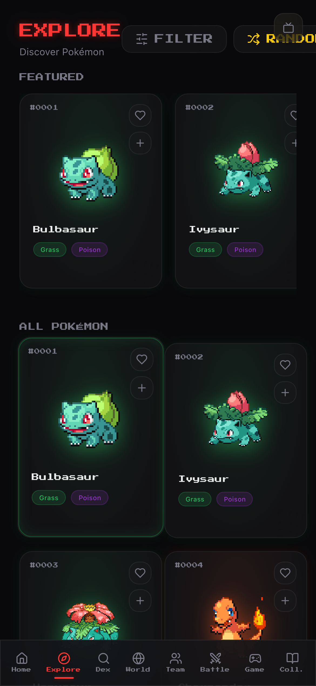
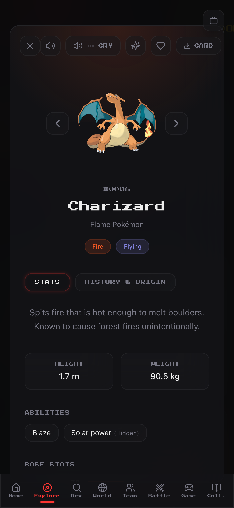

<div align="center">

<br />


<br /><br />

```
  ██████╗  ██████╗ ██╗  ██╗███████╗██████╗ ███████╗██╗  ██╗
  ██╔══██╗██╔═══██╗██║ ██╔╝██╔════╝██╔══██╗██╔════╝╚██╗██╔╝
  ██████╔╝██║   ██║█████╔╝ █████╗  ██║  ██║█████╗   ╚███╔╝
  ██╔═══╝ ██║   ██║██╔═██╗ ██╔══╝  ██║  ██║██╔══╝   ██╔██╗
  ██║     ╚██████╔╝██║  ██╗███████╗██████╔╝███████╗██╔╝ ██╗
  ╚═╝      ╚═════╝ ╚═╝  ╚═╝╚══════╝╚═════╝ ╚══════╝╚═╝  ╚═╝
```

### **The retro-futuristic Pokédex** — explore, build, and battle across every generation.

8-bit nostalgia meets a modern, glassmorphic UI. Powered by [PokéAPI](https://pokeapi.co).

[Live Demo](https://pokedex-dun-eight.vercel.app) · [Report Bug](https://github.com/kutluhangil/Pokedex/issues) · [Request Feature](https://github.com/kutluhangil/Pokedex/issues)

</div>

---

## 🇹🇷 Türkçe Açıklama

**Pokédex**, 1000'den fazla Pokémon'u keşfedebileceğiniz, takım kurup tür analizleri yapabileceğiniz ve tur tabanlı savaşlar simüle edebileceğiniz modern bir web uygulamasıdır. 8-bit nostaljisini cam efektli (glassmorphic) bir arayüz ve akıcı Framer Motion animasyonlarıyla birleştirir. Tüm veriler açık kaynak **PokéAPI**'den gelir, ekstra kuruluma gerek yoktur. 3D dönen dünya haritası, "Bu Pokémon kim?" mini oyunu, evrim ağaçları, tür etkililik tablosu, Pokémon sesleri ve PNG kart paylaşımı gibi özelliklerle dolu, tamamen mobil uyumlu bir deneyim sunar.

---

## ✦ What is Pokédex?

A complete Pokémon companion that runs entirely in the browser. Browse the full national dex, search any species instantly, spin a 3D world map, assemble a six-Pokémon squad with live type-coverage analysis, and run quick 1v1 battle simulations — all wrapped in a CRT-flavored, dark-mode-first interface.

No login. No backend. No setup. Just open it and start exploring.

---

## ⚡ Features

| Feature | Description |
|--------|-------------|
| 🧭 **Explore 1000+** | Browse the full national dex with rich, animated cards and a featured row |
| 🔍 **Instant Dex Search** | Search by name or ID with live results — hit `/` to jump straight to it |
| 🌍 **3D World Globe** | Interactive dotted globe; spin it and tap a region from Kanto to Paldea |
| 👥 **Team Lab** | 6-slot team builder with live type-coverage analysis (defense & offense) |
| ⚔️ **Battle Simulator** | Turn-based 1v1 with full type-chart damage, or fight a random legendary |
| 🎮 **Who's That Pokémon?** | Silhouette guessing mini-game with score and best-streak tracking |
| 📖 **Collection** | Browse by generation and pin your favorites |
| 🔆 **Daily Pokémon** | A fresh featured Pokémon each day, with daily streaks |
| 🧬 **Evolution Trees** | Full evolution chains rendered inline on the detail view |
| 🛡️ **Type Effectiveness** | Built-in type chart so you always know what beats what |
| 🔊 **Pokémon Cries** | Play each Pokémon's real cry from the detail panel |
| 🖼️ **Card Export & Share** | Export any Pokémon as a PNG card or share a team via URL / QR code |
| 📺 **CRT Retro Mode** | One-tap curved-screen scanline effect for full 8-bit nostalgia |
| ⌨️ **Keyboard Shortcuts** | Power-user navigation (`/` search, `?` help, `Esc` close) |
| 📱 **Mobile First** | Fully responsive, glassmorphic UI with safe-area-aware bottom nav |

---

## 🖼️ Screenshots

<div align="center">

| | |
|:---:|:---:|
|  |  |
| **Landing** — Boot into the dex | **Explore** — Browse 1000+ Pokémon |
|  |  |
| **World** — 3D region globe | **Dex** — Instant search |
|  |  |
| **Team Lab** — Build & analyze a squad | **Battle** — Turn-based 1v1 simulator |

</div>

### 📱 Mobile

<div align="center">

&nbsp;&nbsp;
&nbsp;&nbsp;


<sub>Home · Explore · Detail (with cries, evolution & PNG card export)</sub>

</div>

---

## 🛠️ Tech Stack

```
Frontend     →  React 18 · TypeScript · Vite 5
Styling      →  TailwindCSS · shadcn/ui (Radix) · Framer Motion · Press Start 2P
Data         →  TanStack Query · PokéAPI v2 (with in-memory caching)
Charts       →  Recharts (stats & type analysis)
Extras       →  html-to-image (PNG export) · qrcode.react (team share) · Sonner (toasts)
Testing      →  Vitest · Testing Library
Deployment   →  Vercel (SPA) — Lovable-authored
```

---

## 🚀 Getting Started

### Prerequisites

- Node.js `>= 18`
- npm (or [bun](https://bun.sh) — a `bun.lock` is included)

### Local Development

```bash
# Clone the repository
git clone https://github.com/kutluhangil/Pokedex.git
cd Pokedex

# Install dependencies
npm install

# Start the dev server (runs on http://localhost:5173)
npm run dev
```

That's it — there are **no environment variables to configure**. All data comes from the public PokéAPI.

### Available Scripts

| Script | Description |
|--------|-------------|
| `npm run dev` | Start the Vite dev server with hot reload |
| `npm run build` | Production build to `dist/` |
| `npm run build:dev` | Development-mode build |
| `npm run preview` | Preview the production build locally |
| `npm run lint` | Run ESLint |
| `npm run test` | Run the Vitest suite once |
| `npm run test:watch` | Run tests in watch mode |

---

## ☁️ Deployment

The app is a static single-page app, so any static host works. It ships live on Vercel.

### Vercel (Recommended)

1. Push your code to a GitHub repository.
2. Go to [vercel.com/new](https://vercel.com/new) and import the repo.
3. Vercel auto-detects **Vite** — no build config needed.
4. Click **Deploy**.

A [`vercel.json`](vercel.json) is included with an SPA rewrite so client-side routes (and deep links) don't 404:

```json
{
  "rewrites": [{ "source": "/(.*)", "destination": "/" }]
}
```

Once connected to GitHub, every push to `main` deploys automatically and every PR gets a preview URL.

---

## 📐 Project Structure

```
Pokedex/
├── src/
│   ├── components/          # Feature tabs + UI
│   │   ├── ExploreTab.tsx       # Browse the dex
│   │   ├── SearchTab.tsx        # Instant Pokédex search
│   │   ├── WorldTab.tsx         # 3D region globe
│   │   ├── TeamTab.tsx          # Team builder + type analysis
│   │   ├── BattleTab.tsx        # 1v1 battle simulator
│   │   ├── GameTab.tsx          # "Who's That Pokémon?" game
│   │   ├── CollectionTab.tsx    # Generations + favorites
│   │   ├── PokemonDetail.tsx    # Stats, evolution, cries, export
│   │   ├── EvolutionTree.tsx    # Evolution chains
│   │   ├── TypeEffectiveness.tsx# Type chart
│   │   ├── CryPlayer.tsx        # Pokémon cry audio
│   │   ├── DailyPokemon.tsx     # Daily featured + streaks
│   │   ├── CompareModal.tsx     # Side-by-side compare
│   │   └── ui/                  # shadcn/ui primitives
│   ├── hooks/               # useTeam, useFavorites, useDailyPokemon,
│   │                        # useCompare, useKeyboardShortcuts, …
│   ├── lib/
│   │   ├── api.ts               # PokéAPI client + in-memory cache
│   │   ├── pokemon.ts           # Types & helpers (generations, artwork)
│   │   ├── battle.ts            # Battle engine
│   │   ├── typeChart.ts         # Type effectiveness matrix
│   │   └── exportImage.ts       # PNG card export (html-to-image)
│   ├── pages/               # Index (app shell) + NotFound
│   ├── App.tsx              # Router + providers
│   └── main.tsx             # Entry point
├── public/                  # Static assets
├── docs/screenshots/        # README screenshots
└── vercel.json              # SPA rewrite for deployment
```

---

## 📊 How It Works

### Data & Caching
Every Pokémon, species, and evolution chain is fetched on demand from **PokéAPI v2**. A simple in-memory `Map` cache in [`src/lib/api.ts`](src/lib/api.ts) means a Pokémon is only ever fetched once per session — repeat views are instant.

### Team Type Analysis
Add up to six Pokémon in **Team Lab** and the app computes your squad's combined offensive coverage and defensive weaknesses against all 18 types, using the matrix in [`src/lib/typeChart.ts`](src/lib/typeChart.ts). Share a team with anyone via a `?team=1,2,3` URL or a generated QR code.

### Battle Simulator
[`src/lib/battle.ts`](src/lib/battle.ts) runs a turn-based 1v1 using real base stats and type multipliers from the type chart — pick a fighter, choose an opponent (or roll a random legendary), and watch the rounds play out.

### Local-First State
Favorites, daily streaks, best game streak, CRT preference, and the intro flag all live in `localStorage`. No account, no server, no tracking.

---

## 🗺️ Roadmap

| Status | Feature |
|:-:|---|
| ✅ | Explore the full national dex |
| ✅ | Instant Pokédex search |
| ✅ | 3D world / region globe |
| ✅ | Team Lab with type-coverage analysis |
| ✅ | Turn-based battle simulator |
| ✅ | "Who's That Pokémon?" mini-game |
| ✅ | Daily Pokémon + streaks |
| ✅ | Evolution trees & type chart |
| ✅ | Pokémon cries & PNG card export |
| ✅ | CRT retro mode |
| 🔄 | Advanced filters (stats, abilities, regions) |
| 🔄 | Full team battles (6v6) |
| ○ | Shiny sprite toggle |
| ○ | PWA / offline mode |
| ○ | i18n (multi-language UI) |

<sub>✅ Shipped &nbsp; · &nbsp; 🔄 In progress &nbsp; · &nbsp; ○ Planned</sub>

---

## 🤝 Contributing

Contributions are welcome! Feel free to open an issue or submit a pull request.

1. Fork the repository
2. Create your feature branch (`git checkout -b feature/amazing-feature`)
3. Commit your changes (`git commit -m 'feat: add amazing feature'`)
4. Push to the branch (`git push origin feature/amazing-feature`)
5. Open a Pull Request

---

## 🙏 Acknowledgements

- [**PokéAPI**](https://pokeapi.co) — the free, open Pokémon data source powering everything here
- [**shadcn/ui**](https://ui.shadcn.com) & [**Radix UI**](https://www.radix-ui.com) — accessible UI primitives
- Pokémon and all related names are trademarks of Nintendo / Game Freak / The Pokémon Company. This is a non-commercial fan project.

---

## 📄 License

Distributed under the **MIT License**. See [`LICENSE`](LICENSE) for more information.

---

<div align="center">

<br />

Built with ❤️ by [**Kutluhan Gil**](https://github.com/kutluhangil)

<br />

*If you find this useful, consider giving it a ⭐*

<br />

</div>
